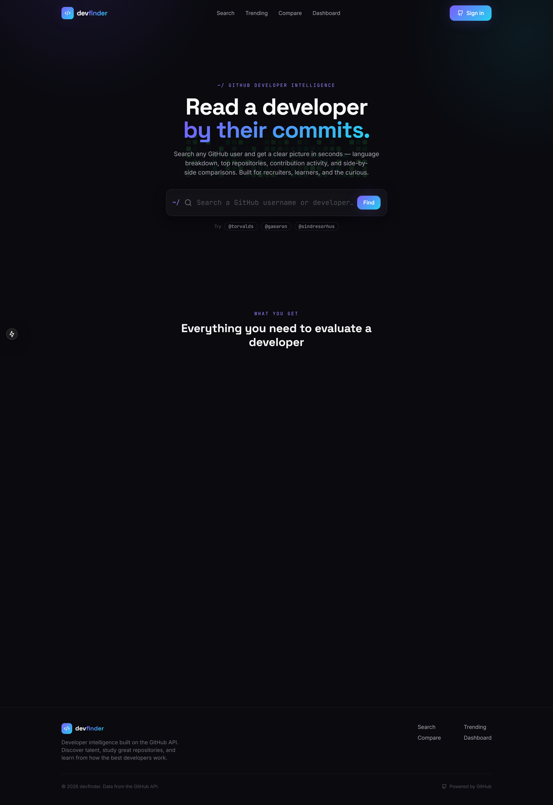
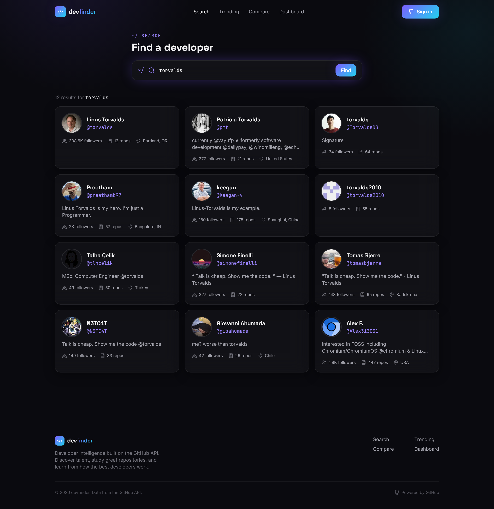
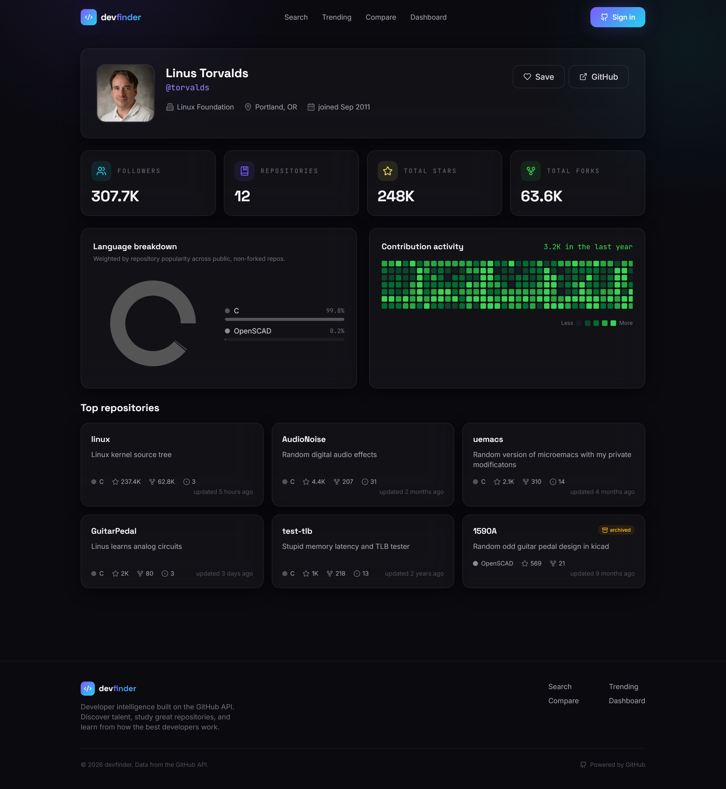
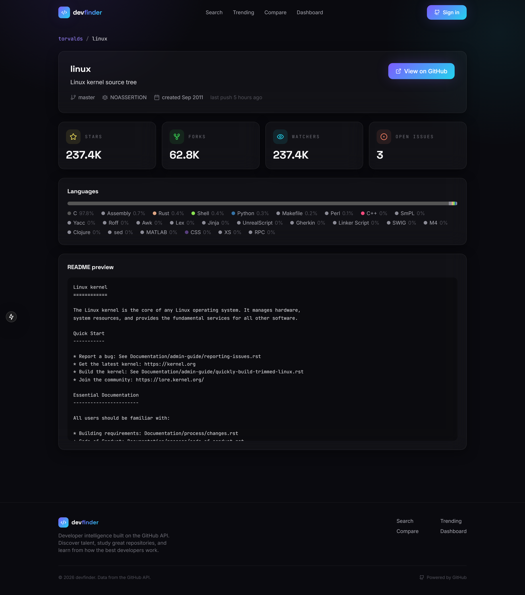
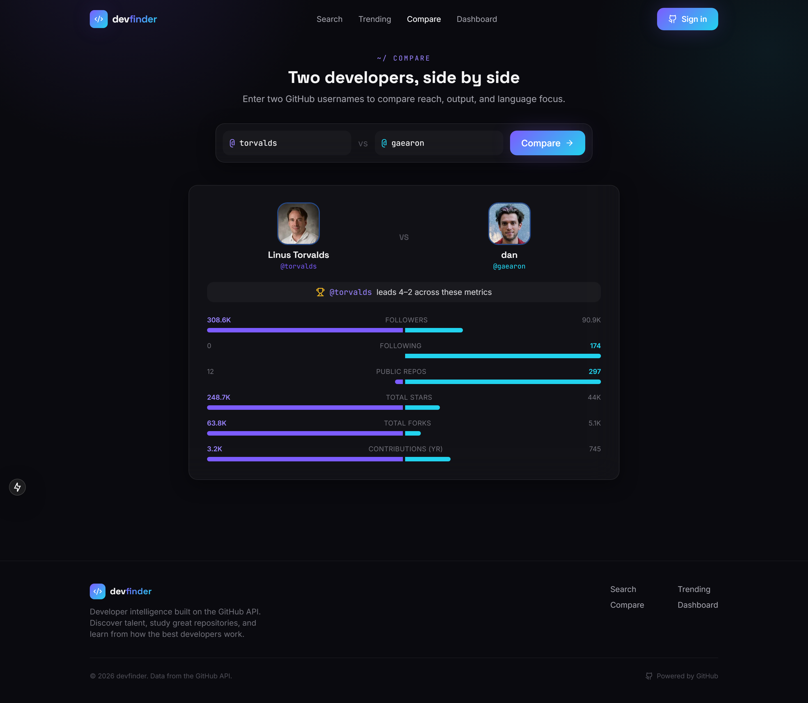
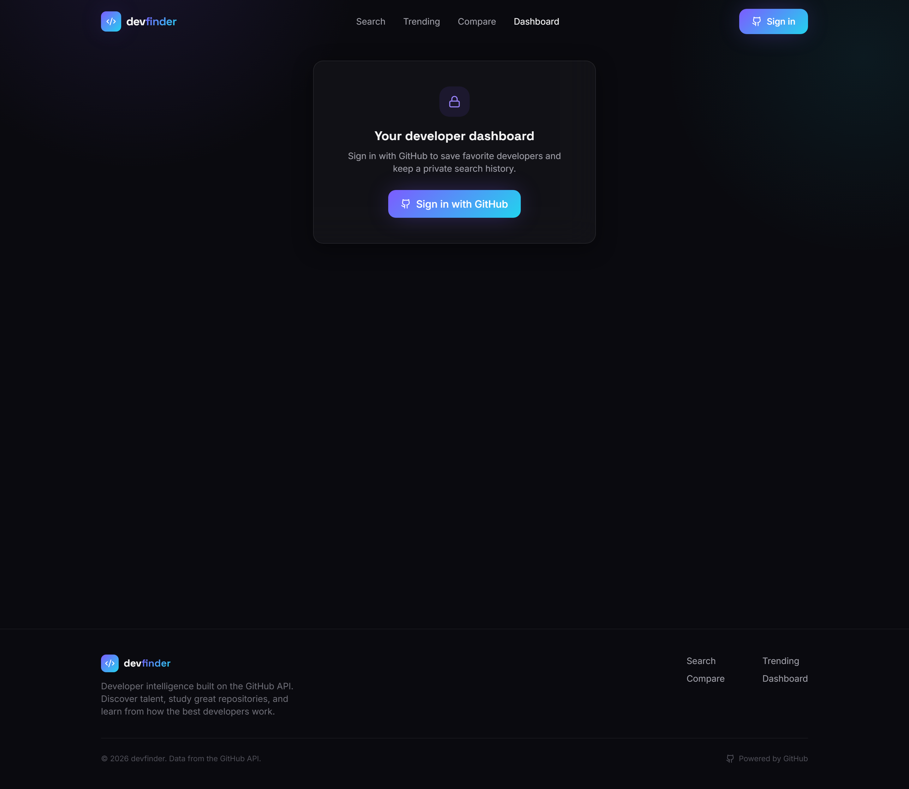

<div align="center">

# 🧭 GitHub Developer Finder

### Developer intelligence, built on the GitHub API.

**Discover, analyze, and compare GitHub developers** — explore profiles, repositories, language breakdowns, and contribution activity in a premium, dark-mode dashboard.

<br />

[](https://nextjs.org/)
[](https://react.dev/)
[](https://developer.mozilla.org/en-US/docs/Web/JavaScript)
[](https://tailwindcss.com/)
[](https://www.framer.com/motion/)
[](https://www.mongodb.com/atlas)
[](https://authjs.dev/)

<br />

[](#-license)
[](#)
[](#-author)


<br />

[**Live Demo**](#) · [**Report Bug**](https://github.com/achrafdev89/github-dev-finder/issues) · [**Request Feature**](https://github.com/achrafdev89/github-dev-finder/issues)

</div>

---

## ✨ Overview

**GitHub Developer Finder** turns raw GitHub data into a clear, readable picture of any developer. Search a username and instantly see their language mix, top repositories, contribution activity, and key metrics — then save the ones worth remembering or put two developers side by side.

Built for **recruiters** evaluating talent, **developers** learning from the best, and anyone curious about the open-source ecosystem.

---

## 🚀 Features

| | Feature | Description |
| :--: | :-- | :-- |
| 🔍 | **GitHub User Search** | Find any developer by username or name with instant, hydrated result cards. |
| 👤 | **Developer Profiles** | Bio, links, followers, repos, total stars/forks, and contribution heatmap at a glance. |
| 📦 | **Repository Explorer** | Browse a developer's top repositories sorted by traction. |
| 📄 | **Repository Details** | Description, topics, stars/forks/watchers/issues, license, language bar, and README preview. |
| ⚖️ | **Developer Comparison** | Two developers side by side across followers, stars, repos, and reach — with a winner summary. |
| 🔥 | **Trending Repositories** | The most-starred repos created this week, filterable by language. |
| 📊 | **Language Statistics** | Popularity-weighted language breakdown rendered as an animated donut + bars. |
| ❤️ | **Favorites** | Save developers to your account and revisit them anytime (optimistic UI). |
| 🕘 | **Search History** | Per-user search history, auto-recorded and clearable. |
| 🔐 | **Authentication** | Secure GitHub OAuth sign-in via Auth.js with MongoDB-backed sessions. |
| 📈 | **Personal Dashboard** | A private overview of your favorites and recent searches. |
| 📱 | **Responsive Design** | Mobile-first layout that scales cleanly to desktop. |
| 🌙 | **Dark Mode** | Premium dark theme by default with glassmorphism surfaces. |
| 🎞️ | **Framer Motion Animations** | Page transitions, scroll reveals, hover micro-interactions, and animated counters. |

---

## 🖼️ Screenshots

> Generated automatically with Playwright — see [`scripts/screenshots.js`](scripts/screenshots.js).

<div align="center">

### 🏠 Homepage


### 🔍 Search


### 👤 Developer Profile


### 📦 Repository Explorer


### ⚖️ Compare Developers


### 📈 Dashboard


</div>

---

## 🎬 Demo

> Recorded automatically with Playwright — see [`scripts/demo.js`](scripts/demo.js).

<div align="center">


</div>

---

## 🧱 Tech Stack

<table>
  <tr>
    <td><strong>Frontend</strong></td>
    <td>Next.js 15 (App Router) · React 19 · JavaScript (ES2022) · Tailwind CSS · Framer Motion · Recharts · Lucide Icons</td>
  </tr>
  <tr>
    <td><strong>Backend</strong></td>
    <td>Next.js Server Components · Server Actions · Route Handlers</td>
  </tr>
  <tr>
    <td><strong>Database</strong></td>
    <td>MongoDB Atlas · Mongoose ODM</td>
  </tr>
  <tr>
    <td><strong>Authentication</strong></td>
    <td>Auth.js (NextAuth v5) · GitHub OAuth · MongoDB session adapter</td>
  </tr>
  <tr>
    <td><strong>APIs</strong></td>
    <td>GitHub REST API · GitHub GraphQL API (contribution calendar)</td>
  </tr>
  <tr>
    <td><strong>Tooling</strong></td>
    <td>ESLint · Playwright (screenshots + demo GIF)</td>
  </tr>
  <tr>
    <td><strong>Deployment</strong></td>
    <td>Vercel · Netlify · Cloudflare Pages</td>
  </tr>
</table>

---

## 🗂️ Project Structure

```
github-dev-finder/
├── public/
├── screenshots/                  # Auto-generated UI screenshots
├── assets/                       # Auto-generated demo.gif
├── scripts/
│   ├── screenshots.js            # Playwright screenshot automation
│   └── demo.js                   # Playwright demo-GIF recorder
├── src/
│   ├── app/
│   │   ├── layout.jsx            # Fonts, providers, navbar, footer
│   │   ├── page.jsx              # Landing (hero + features)
│   │   ├── globals.css           # Design tokens + glassmorphism utilities
│   │   ├── loading.jsx
│   │   ├── error.jsx
│   │   ├── not-found.jsx
│   │   ├── search/page.jsx
│   │   ├── developer/[username]/
│   │   │   ├── page.jsx
│   │   │   ├── loading.jsx
│   │   │   └── not-found.jsx
│   │   ├── repository/[owner]/[name]/page.jsx
│   │   ├── compare/page.jsx
│   │   ├── trending/page.jsx
│   │   ├── dashboard/page.jsx
│   │   ├── favorites/page.jsx
│   │   ├── settings/page.jsx
│   │   ├── actions/              # Server actions (favorites, history)
│   │   │   ├── favorites.js
│   │   │   └── history.js
│   │   └── api/auth/[...nextauth]/route.js
│   ├── components/
│   │   ├── Navbar.jsx
│   │   ├── Footer.jsx
│   │   ├── SearchBar.jsx
│   │   ├── DeveloperCard.jsx
│   │   ├── RepositoryCard.jsx
│   │   ├── StatCard.jsx
│   │   ├── LanguageChart.jsx
│   │   ├── ContributionGraph.jsx
│   │   ├── CompareForm.jsx
│   │   ├── CompareView.jsx
│   │   ├── FavoriteButton.jsx
│   │   ├── FavoritesGrid.jsx
│   │   ├── AuthButton.jsx
│   │   ├── SignInPrompt.jsx
│   │   ├── SettingsActions.jsx
│   │   ├── TrendingFilter.jsx
│   │   ├── Providers.jsx
│   │   ├── Motion.jsx
│   │   ├── sections/Hero.jsx
│   │   └── ui/
│   │       ├── AnimatedCounter.jsx
│   │       └── Skeletons.jsx
│   └── lib/
│       ├── github.js             # REST + GraphQL client & aggregation
│       ├── mongodb.js            # Cached Mongoose + native client
│       ├── auth.js               # Auth.js config
│       ├── utils.js
│       ├── repoLanguages.js
│       └── models/
│           ├── Favorite.js
│           └── SearchHistory.js
├── .env.local                    # Your secrets (git-ignored)
├── jsconfig.json                 # Path alias (@/*) for editors
├── next.config.mjs
├── tailwind.config.js
├── postcss.config.mjs
└── package.json
```

---

## ⚙️ Installation

### Prerequisites
- **Node.js** 18.18+ (20 LTS recommended)
- A **MongoDB Atlas** cluster
- A **GitHub OAuth App** + a **GitHub personal access token**

### 1. Clone the repository
```bash
git clone https://github.com/achrafdev89/github-dev-finder.git
cd github-dev-finder
```

### 2. Install dependencies
```bash
npm install
```

### 3. Create your environment file
```bash
cp .env.example .env.local
# then fill in the values (see below)
```

### 4. Run the development server
```bash
npm run dev
# http://localhost:3000
```

### 5. Build for production
```bash
npm run build
npm run start
```

---

## 🔑 Environment Variables

Create a `.env.local` file in the project root:

```env
# GitHub API token (scopes: read:user, public_repo) — raises rate limits & enables the contribution graph
GITHUB_TOKEN=

# MongoDB Atlas connection string (include a database name, e.g. /github_finder)
MONGODB_URI=

# Auth.js secret — generate with: npx auth secret
NEXTAUTH_SECRET=

# App URL — http://localhost:3000 locally, your domain in production
NEXTAUTH_URL=

# GitHub OAuth App credentials (callback: /api/auth/callback/github)
AUTH_GITHUB_ID=
AUTH_GITHUB_SECRET=
```

> 💡 With **Auth.js v5**, `NEXTAUTH_SECRET` / `NEXTAUTH_URL` are also recognized as `AUTH_SECRET` / `AUTH_URL`. Use whichever your version expects.
>
> ✅ This project reads `AUTH_SECRET`, `AUTH_URL`, `AUTH_GITHUB_ID`, and `AUTH_GITHUB_SECRET`. The GitHub credentials **must** come from a GitHub OAuth App (Settings → Developer settings → OAuth Apps) — not any other provider.

---

## ☁️ Deployment

### ▲ Vercel (recommended)
1. Push your repo to GitHub and **Import** it in Vercel.
2. Add every variable from `.env.local` under **Project → Settings → Environment Variables**.
3. Set `NEXTAUTH_URL` (or `AUTH_URL`) to your production domain.
4. Add the production callback URL in your GitHub OAuth App: `https://YOUR_DOMAIN/api/auth/callback/github`.
5. Allow Vercel egress in **MongoDB Atlas → Network Access**.
6. **Deploy** — Next.js is auto-detected.

### 🌐 Netlify
1. Install the official adapter: `npm i -D @netlify/plugin-nextjs`.
2. Add a `netlify.toml`:
   ```toml
   [build]
     command = "npm run build"
     publish = ".next"

   [[plugins]]
     package = "@netlify/plugin-nextjs"
   ```
3. Set the same environment variables in **Site settings → Environment variables**.
4. Add the production OAuth callback URL and **Deploy**.

### 🟧 Cloudflare Pages
1. Connect the repo in **Cloudflare Pages**.
2. Framework preset: **Next.js**. Build command: `npm run build`.
3. Add environment variables under **Settings → Environment variables**.
4. Set the production callback URL in your GitHub OAuth App and **Deploy**.

---

## 🔮 Future Features

- 🤖 **AI Developer Recommendations** — suggest developers and repos based on your interests and history.
- 📄 **Resume Analysis** — match a candidate's GitHub footprint against a job description.
- 🧩 **Team Builder** — assemble a balanced team by complementary languages and strengths.
- 🌍 **Open Source Discovery** — surface beginner-friendly issues and projects to contribute to.

---

## 👤 Author

<div align="center">

**Achraf Chibane**

[](https://github.com/achrafdev89)

</div>

---

## 📝 License

Distributed under the **MIT License**. See [`LICENSE`](LICENSE) for details.

```
MIT License — © 2026 Achraf Chibane
```

---

<div align="center">

⭐ **If you found this project useful, consider giving it a star!** ⭐

<br />

Data from the GitHub API · Not affiliated with GitHub, Inc.

</div>
